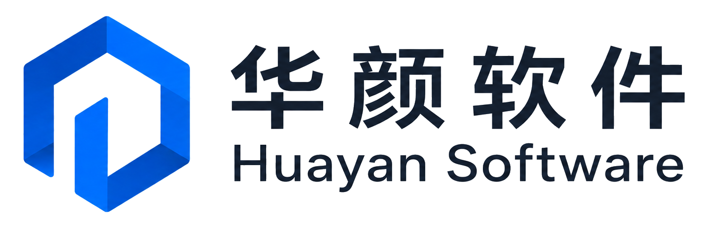
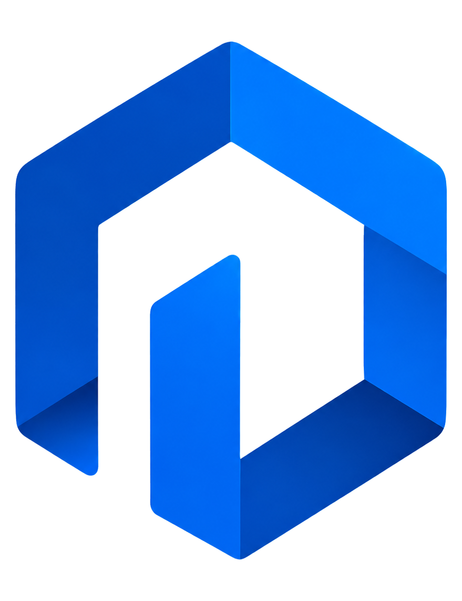

# HyRemote

**Qt Embedded Remote Access Framework**

<p align="center">
  
</p>

HyRemote is an open-source remote access framework for Qt applications. It is designed to add remote display and remote input capabilities to existing Qt applications without forcing an application to adopt a single integration model, rendering stack, transport, or SoC-specific implementation.

> Status: **pre-alpha**. Product capabilities, compatibility claims, SDK packaging, examples, and release milestones are still being completed toward the first GA release.

## Product integration modes

HyRemote is productized through three integration modes:

1. **Embedded C++ API** — stable, explicit integration for maximum control and performance.
2. **Declarative QML API** — convenient integration for Qt Quick applications using the same core semantics.
3. **Transparent QPA Proxy** — optional low/zero-source-change compatibility path for existing Qt applications.

Qt Widgets and Qt Quick are first-class application types. The integration mode is a product capability; capture, transport, input, and hardware acceleration remain replaceable implementation layers.

## How applications consume HyRemote

HyRemote is an independent SDK/framework. It does not modify the user's Qt installation, but after it has been installed or added as source once, normal usage is designed to feel like using a Qt module.

The target installed-SDK CMake experience is:

```cmake
find_package(Qt6 REQUIRED COMPONENTS Widgets)
find_package(HyRemote CONFIG REQUIRED)

target_link_libraries(MyApp PRIVATE
    Qt6::Widgets
    HyRemote::RemoteAccess
)
```

The target Embedded C++ application experience is intentionally small:

```cpp
#include <HyRemote/RemoteAccess.h>

HyRemote::RemoteAccess remote(window);
remote.start();
```

`QWidget`/Widgets targets and `QQuickWindow` targets use the same product-level facade. Internal `Session`, `RemoteFrame`, capture, input, transport and protocol-backend objects are not part of the normal application integration contract.

HyRemote will support both:

- **prebuilt Windows/Linux SDKs** with normal CMake package discovery and deployment support;
- **source consumption** through normal CMake integration for open-source, embedded and cross-compilation workflows.

The canonical SDK/user-consumption contract is [`docs/sdk-consumption.md`](docs/sdk-consumption.md).

The declarative milestone later exposes the same product semantics through a normal QML module, conceptually:

```qml
import HyRemote

RemoteAccess {
    target: mainWindow
    enabled: true
}
```

Examples and user guides are release acceptance artifacts. V0.0.1.0 is not complete until the public C++ facade, SDK/source-consumption paths, Widgets/Quick examples, Windows/Linux getting-started guides and deployment instructions are reproducible.

## Architecture direction

```text
Qt Application
  ├─ Qt Widgets
  ├─ Qt Quick
  ├─ Quick3D
  ├─ QOpenGLWidget
  └─ QQuickWidget
         │
    Public RemoteAccess facade
         │
    Target Adapter
         │
    Capture Backend
         │
  ┌──────┼───────────┐
  │      │           │
Raster  GL/PBO   GBM/DMA-BUF
  │      │           │
  └──────┴─────┬─────┘
               │
          RemoteFrame
      pixels/damage/PTS
               │
         Transport Layer
               │
        VNC/RFB first
               │
            Viewer

Viewer Input → Transport → Input Adapter → Qt Event
```

VNC/RFB is the first transport family, but its concrete backend is an internal implementation choice. HyRemote should reuse a maintained protocol implementation where practical instead of reimplementing RFB by default. A backend is selected only when it satisfies protocol, security, backpressure, packaging and downstream toolchain requirements without leaking complexity into the public product API.

## Design principles

- **Existing applications first.** Adding remote access must not require rewriting application UI or business logic.
- **Qt-like consumption experience.** After acquiring HyRemote once, users should integrate it through normal CMake/QML mechanisms instead of assembling internal subsystems.
- **Three product integration modes.** C++ API, QML API, and optional QPA Proxy are distinct user-facing capabilities.
- **Qt Widgets and Qt Quick are peers.** Neither is treated as a compatibility afterthought.
- **Public API first.** Stable user-facing APIs and Qt public APIs define the supported contract; private/QPA integration stays isolated in optional adapters.
- **Backend separation.** Target, capture, transport, input, and hardware encoding are independent implementation interfaces.
- **Backend invisibility.** Switching the default VNC/capture backend must not require normal application-source changes.
- **Portable baseline before hardware optimization.** Correctness comes before PBO, DMA-BUF, GBM, or hardware video encoding.
- **Hardware acceleration is pluggable.** SoC-specific acceleration may be added without becoming a generic-core dependency.
- **No protocol lock-in.** VNC/RFB is the first transport, not the permanent boundary of the project.

## Product roadmap and versioning

HyRemote uses four-part product versions:

```text
Major.Minor.Feature.Maintenance
```

The version number represents product capability and compatibility, not the internal technical work breakdown. The canonical rules are in [`docs/versioning.md`](docs/versioning.md).

### x86_64 reference platform — Windows + Linux

The x86_64 standard/reference platform includes **both Windows x86_64 and Linux x86_64**. Each pre-GA integration-mode milestone must be validated on both operating systems; one OS does not substitute for the other.

| Version | Product milestone |
| --- | --- |
| `V0.0.1.0` | x86_64 (Windows + Linux) — Embedded C++ API |
| `V0.0.2.0` | x86_64 (Windows + Linux) — Declarative QML API |
| `V0.0.3.0` | x86_64 (Windows + Linux) — Transparent QPA Proxy |
| `V1.0.0.0` | x86_64 GA — Windows + Linux and all three integration modes productized |

### Embedded-platform expansion after V1.0

After `V1.0.0.0`, each newly formalized embedded platform family receives a new `V1.x.0.0` product line. Within that line, independently deliverable integration modes use `V1.x.y.0`.

For example:

```text
V1.x.0.0   platform family enters formal support
V1.x.1.0   Embedded C++ API
V1.x.2.0   Declarative QML API
V1.x.3.0   Transparent QPA Proxy
```

The near-term embedded operating-system baseline is **Embedded Linux**. Platform ordering is a product-roadmap decision based on supported-OS and Qt ecosystem maturity, industrial relevance, BSP maturity, hardware availability, and customer demand. Rockchip and NXP i.MX are current high-priority candidates; other mainstream Linux embedded platforms can be added under the same model.

**OpenHarmony is a long-term embedded OS direction.** It is intentionally not a current delivery gate and must not delay x86 GA or the initial Embedded Linux platform expansion. Its concrete version mapping will be decided only after the Qt/OpenHarmony integration boundary, graphics/input stack, toolchain/BSP maturity, and compatibility with the existing HyRemote product contract have been validated.

Core, capture, transport, RemoteFrame, DMA-BUF, hardware encoding, CI, and similar engineering work are WBS/tasks under these product milestones; they are not top-level product milestones themselves.

## Compatibility policy

A platform or integration mode is considered **supported** only when it has repeatable evidence for its claimed environment, including:

- the claimed operating system;
- a reproducible build and supported SDK/source-consumption path;
- functional remote-view and, where applicable, remote-input validation;
- a compatibility entry;
- documented known limitations.

For x86_64, Windows evidence does not substitute for Linux evidence and Linux evidence does not substitute for Windows evidence. Desktop/x86 validation must not be used as a substitute for an embedded-platform support claim.

## Current non-goals

The early product will not:

- replace a general-purpose operating-system remote desktop system;
- expose backend-specific APIs to normal application developers;
- implement the RFB protocol from scratch when a suitable maintained library exists;
- require Wayland migration merely to enable remote maintenance;
- promise zero-copy or hardware H.264 before measured proof;
- make Qt private/QPA APIs part of the stable core contract;
- make OpenHarmony support a gate for `V1.0.0.0` or the first Embedded Linux platform releases.

## Contributing

Contribution and architecture rules are documented in [`CONTRIBUTING.md`](CONTRIBUTING.md) and `docs/`.

## License

HyRemote is licensed under the **Apache License 2.0**. See [`LICENSE`](LICENSE).

Third-party components remain subject to their own licenses and attribution requirements.

### Logo and brand assets

<p align="center">
  
</p>

| Asset | Project use |
| --- | --- |
| [`logo/huayan-software-horizontal.png`](logo/huayan-software-horizontal.png) | Primary repository/project lockup; rendered at the top of this README |
| [`logo/huayan-logo-single.png`](logo/huayan-logo-single.png) | Compact brand mark for square/icon placements and project documentation |

The image files are distributed with this repository under Apache-2.0. Apache License 2.0 section 6 does **not** grant trademark rights: copying/redistribution of the files does not grant permission to present a fork, derivative, or unrelated product as the owner of these marks. Downstream products should use their own branding unless separately authorized.
