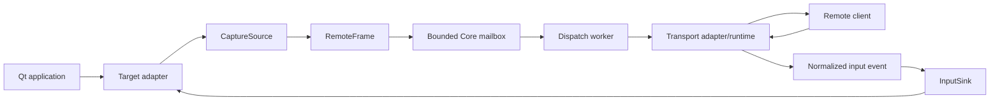
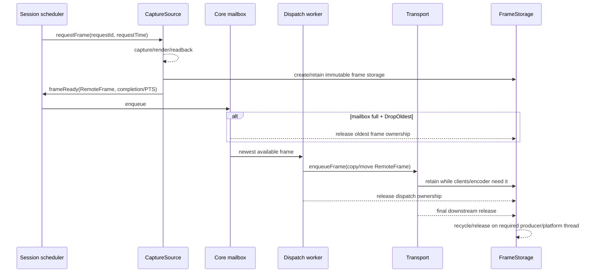
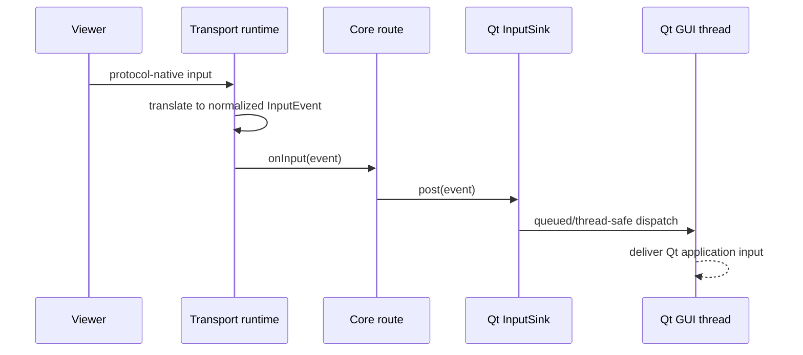
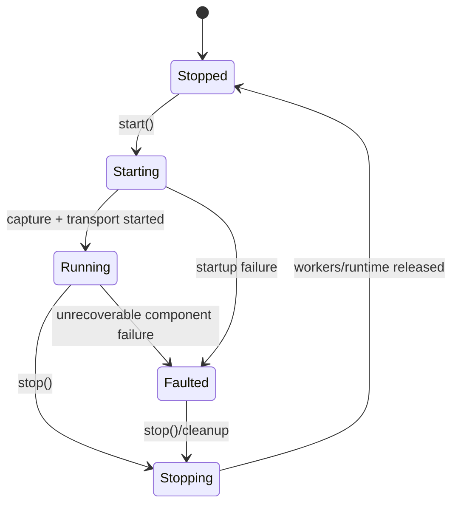

# HyRemote Core Architecture Contract

Status: **ARCH-01 proposal**

Issue: #5

This document connects ADR-0001/0002/0003 into one implementation-ready flow for the v0.1 MVP. It does not claim RK3588/EGLFS validation; #18 remains the embedded evidence gate.

## Implementation status

`hyremote-core` implements the semantic contract fixed here (issue #21, CORE-02). Target adapters,
transports and encoding remain out of scope.

| Contract element | Implementation |
|---|---|
| one Session, one capture source, one transport, optional input sink | `Session` (`session.hpp`) |
| frame lifetime anchored by owned storage | `RemoteFrame::storage` + `CpuFrameStorage`, `FrameStorage::extension()` for platform domains |
| damage `Unknown` / `FullFrame` / `Regions` | `Damage` + `Damage::hasRegions()`; an empty `Regions` list is explicitly not `Unknown` |
| content PTS vs request diagnostics | `FrameTiming` + `normalizeFrameTiming()`: request time is never promoted to PTS, a declared Render/Presentation source must supply its value |
| `FrameId` in acceptance order | assigned when the mailbox accepts the frame, not in request order |
| bounded completed-frame mailbox | `DropOldest` (latest-frame-wins) default with an explicit `ProducerThrottle` alternative; Core-side ownership is bounded by `capacity + 1` |
| capture callback never performs transport work | capture completion only validates, stamps and enqueues; the dispatch worker is the only `Transport::enqueueFrame()` caller |
| capability negotiation before `Running` | `checkFrameCompatibility()` |

Build: `HYREMOTE_BUILD_CORE` (ON by default) with `HYREMOTE_BUILD_TESTS`; the library is
`hyremote-core` with the `HyRemote::Core` alias and headers under `hyremote/core/`. The
`spikes/` trees stay non-production and are not linked by Core.

## 1. Canonical pipeline



The Core sees neither QWidget/QQuickWindow nor NeatVNC/RKMPP/GBM concrete types.

## 2. Widgets end-to-end v0.1 path

```text
QWidget target
  -> hyremote-widgets adapter
  -> QWidget::render() into adapter-owned/recycled storage
  -> RemoteFrame { Completion PTS, Damage Regions/Unknown }
  -> Core bounded mailbox (default candidate: capacity 2, DropOldest)
  -> dispatch worker
  -> hyremote-vnc
  -> NeatVNC runtime / clients
```

Notes:

- the Widgets adapter runs capture work on the Qt GUI thread;
- separate top-level dialogs/popups are not implicitly part of one QWidget target;
- observed paint regions are normalized to root coordinates before becoming damage candidates;
- mixed QOpenGLWidget/QQuickWidget cases retain their documented synchronous host baselines unless later target evidence justifies another backend.

## 3. Native Qt Quick end-to-end v0.1 candidate

```text
QQuickWindow target
  -> hyremote-quick adapter
  -> contentItem()->grabToImage() request
  -> ready() completion / immutable snapshot
  -> RemoteFrame { PTS = ready() fallback, Damage = Unknown }
  -> Core bounded mailbox
  -> dispatch worker
  -> hyremote-vnc
  -> remote clients
```

Notes:

- `contentItem()` rather than the application's QML root is the host-validated whole-scene target for same-scene sibling/overlay-tree content;
- request time is latency diagnostics only;
- capture scheduling bounds outstanding requests; initial candidate `maxInFlight=2`;
- hidden targets can reject the async request; the adapter reports a recoverable capture event or uses a configured synchronous fallback;
- this is a **public-API baseline/v0.1 candidate**, not a final performance claim for EGLFS.

## 4. Frame lifetime sequence



A naked pixel pointer is never the lifetime contract. `FrameStorage` is.

## 5. Backpressure sequence

```mermaid
sequenceDiagram
    participant C as Capture
    participant Q as Core mailbox cap=2
    participant D as Dispatcher
    participant T as Slow transport

    C->>Q: F1
    C->>Q: F2
    D->>T: F1 (dispatcher owns one)
    C->>Q: F3
    C->>Q: F4
    Note over Q: queue full; DropOldest removes F2
    C->>Q: F5
    Note over Q: queue full; DropOldest removes F3
    T-->>D: accepts/returns
    D->>T: newest queued frame
```

The queue capacity counts waiting frames; the dispatcher-owned frame is in addition. Transport/client modules must also bound their own downstream queues.

## 6. Input sequence



The exact keyboard-symbol schema remains intentionally unfrozen in #5; the threading/translation boundary is frozen.

## 7. State machine



Recoverable client/capture events do not automatically fault the Session.

## 8. Error model

| Layer | Example | Core behavior |
|---|---|---|
| configuration | missing capture source, invalid capacity | `start()` fails before Running |
| recoverable capture | hidden Quick window rejects request | report event; retry/fallback policy may continue |
| target failure | QObject/target permanently lost | fallback if configured, otherwise Faulted |
| transport client | disconnect/auth rejection | transport event; Session remains Running |
| transport runtime | listener/runtime cannot operate | Faulted |
| queue overload | newest frame arrives while full | normal DropOldest flow, not an error |
| encoder/platform optional path | unsupported external storage | capability mismatch/fallback; do not corrupt frame lifetime |

## 9. Capability negotiation

v0.1 should negotiate only what is necessary:

- capture source output CPU pixel formats;
- whether damage regions are trustworthy;
- whether capture is asynchronous;
- whether a backend supplies render/presentation PTS;
- whether CPU mapping exists;
- optional external-storage domain tags.

The Core should select/fail early rather than silently reinterpret an unsupported format.

#17 may add concrete external storage descriptors and encoder compatibility without changing these negotiation categories.

## 10. API ownership

The design-level header is [`proposals/hyremote_core.hpp`](proposals/hyremote_core.hpp).

It is **not** the frozen public include tree. #6/#7 implementation may refine names/signatures while preserving the architectural invariants:

1. one Session model for Widgets/Quick;
2. frame lifetime anchored by owned storage;
3. request timestamp is not content PTS;
4. damage has Unknown/Full/Regions semantics;
5. slow transport does not block capture by default;
6. platform/protocol types do not leak into Core;
7. transport-specific client backpressure remains transport-owned.

## 11. Evidence/dependency status

| Dependency | Status / effect on #5 |
|---|---|
| #3 / PR #15 | host ownership/damage/correctness evidence accepted |
| #16 / PR #19 | host public-async/backpressure/timestamp evidence accepted |
| #4 | NeatVNC conditional GO; Transport remains concrete-type isolated |
| #18 | RK3588/EGLFS still open; may tune backend/defaults, not Core invariants |
| #17 | low-copy/external storage still open; may refine `External` descriptor, not lifetime invariant |

Therefore #5 can freeze the **semantic Core contract** before #17/#18 complete, while implementation choices that depend on those issues remain conditional.
